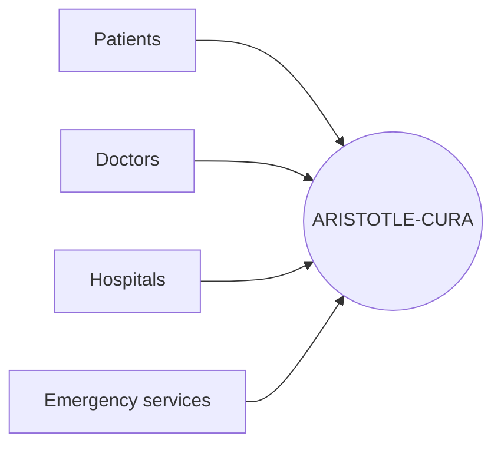
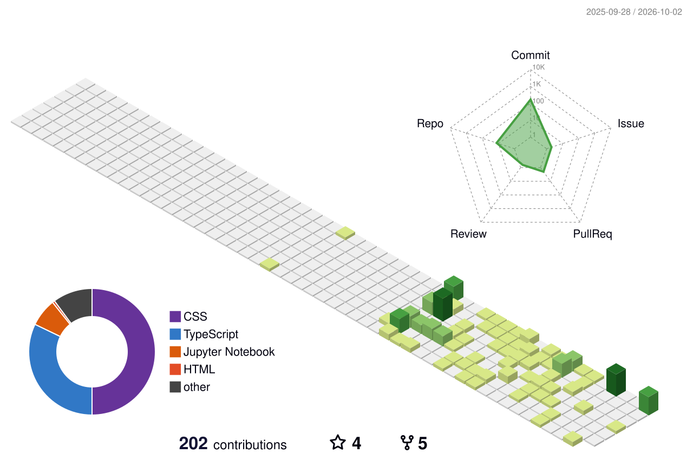
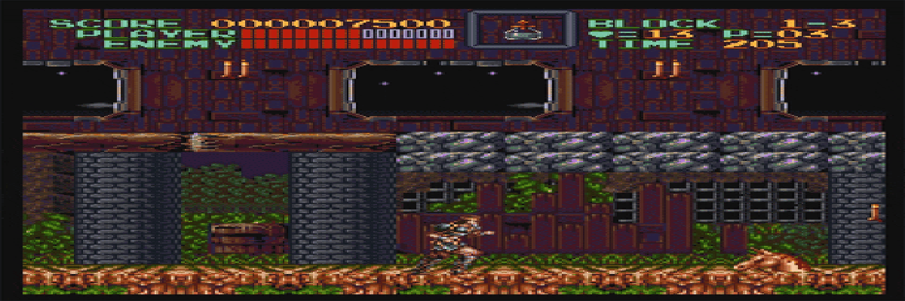

**I build full-stack products in TypeScript and React, from first prototype to live deployment.**

Currently open to **Software Engineer** and **Full-Stack / Frontend** roles, full-time and internships.

 

 

## About

I'm a Computer Science student in my final year, based in Telangana, India. I learn by building: I take things apart to understand how they work, then rebuild them better. Every project below is deployed and live.

| | |
|---|---|
| **Education** | B.Tech, Computer Science · YOUR_COLLEGE · Class of YOUR_GRAD_YEAR |
| **Focus** | Full-stack web development, TypeScript, React |
| **Building** | Healthcare tech, AI interfaces, live news aggregation |
| **Exploring** | Accessibility-first frontend design, production-ready AI workflows |

 

## Selected Work

<table>
<tr>
<td width="50%" valign="top">

### [ARISTOTLE-CURA](https://github.com/ARISTOTLE-CREATOR/ARISTOTLE-CURA)
*Healthcare platform*

One connected system for patients, doctors, hospitals, and emergency services, instead of scattered tools.

<!-- TODO: one line on YOUR part + a result, e.g. "Built role-based dashboards and the emergency request flow." -->

[Live demo](https://aristotle-cura.vercel.app/) · [Source](https://github.com/ARISTOTLE-CREATOR/ARISTOTLE-CURA)

</td>
<td width="50%" valign="top">

### [AURA](https://github.com/ARISTOTLE-CREATOR/AURA)
*AI communication platform (frontend prototype)*

An exploration of what an AI communication interface looks like when accessibility is a design constraint from day one.

<!-- TODO: name 1-2 concrete accessibility choices, e.g. keyboard navigation, contrast ratios, ARIA labels. -->

[Live demo](https://aura-five-theta.vercel.app/) · [Source](https://github.com/ARISTOTLE-CREATOR/AURA)

</td>
</tr>
<tr>
<td width="50%" valign="top">

### [LUMINOUS](https://github.com/ARISTOTLE-CREATOR/LUMINOUS)
*Open academic resource hub*

Semester-wise notes, study materials, and learning resources for engineering students, all in one place.

<!-- TODO: add usage if you have it, e.g. "Used by N classmates". -->

[Live demo](https://aristotle-creator.github.io/LUMINOUS/) · [Source](https://github.com/ARISTOTLE-CREATOR/LUMINOUS)

</td>
<td width="50%" valign="top">

### [MY-PORTFOLIO](https://github.com/ARISTOTLE-CREATOR/MY-PORTFOLIO)
*Software engineering portfolio*

A portfolio of real-world products and technical projects, with deeper write-ups than a README allows.

[Live site](https://my-portfolio-vert-six-94.vercel.app/) · [Source](https://github.com/ARISTOTLE-CREATOR/MY-PORTFOLIO)

</td>
</tr>
</table>

**In progress:** [V.I.R.U.S](https://github.com/ARISTOTLE-CREATOR/V.I.R.U.S), a global live news aggregation platform.
**Community:** contributor to [prompt-to-production](https://github.com/nasscomAI/prompt-to-production), nasscomAI's scaffolding for vibe sessions.

<b>How ARISTOTLE-CURA connects its users</b>

 

 

## Tech Stack

<picture>
  <source media="(prefers-color-scheme: dark)" srcset="https://skillicons.dev/icons?i=ts,js,py,html,css,react,nodejs,tailwind,vite,git,github,githubactions,vercel,vscode&theme=dark&perline=7">
  <source media="(prefers-color-scheme: light)" srcset="https://skillicons.dev/icons?i=ts,js,py,html,css,react,nodejs,tailwind,vite,git,github,githubactions,vercel,vscode&theme=light&perline=7">
  
</picture>

<!-- TODO: add backend/database tools you actually use by appending ids above, e.g. express,postgres,mongodb,supabase,firebase,docker -->

 

## How I Work

- **Ship, then iterate.** A live link teaches more than a local build.
- **Accessibility is part of "done."** Keyboard support, contrast, and semantics are built in, not bolted on.
- **Understand before patching.** When something breaks, I find out why first.
- **Prototype to product.** I care about structure, naming, deployment, and docs.

 

## GitHub Snapshot

<picture>
  <source media="(prefers-color-scheme: dark)" srcset="./profile-3d-contrib/profile-night-green.svg">
  <source media="(prefers-color-scheme: light)" srcset="./profile-3d-contrib/profile-green.svg">
  
</picture>

 

<!-- The 3D graph needs the profile-3d.yml workflow to run once. The two stats cards come from a public server that is sometimes rate-limited; delete those two lines if they ever show an error. -->

 

## Beyond the Code

<!-- TODO: add one personal line here, e.g. what you play, build, or do outside coding. -->

 

## Let's Talk

I'm looking for a team where I can learn fast, ship real features, and take ownership, especially in healthcare, AI products, and developer tools.

**Email:** [sainithin172005@gmail.com](mailto:sainithin172005@gmail.com) · **LinkedIn:** [rapolu-sai-nithin](https://www.linkedin.com/in/rapolu-sai-nithin) · **Reddit:** [Bug-To-Feature](https://www.reddit.com/u/Bug-To-Feature/)

 

*"Curiosity starts the idea. Engineering makes it real."*

